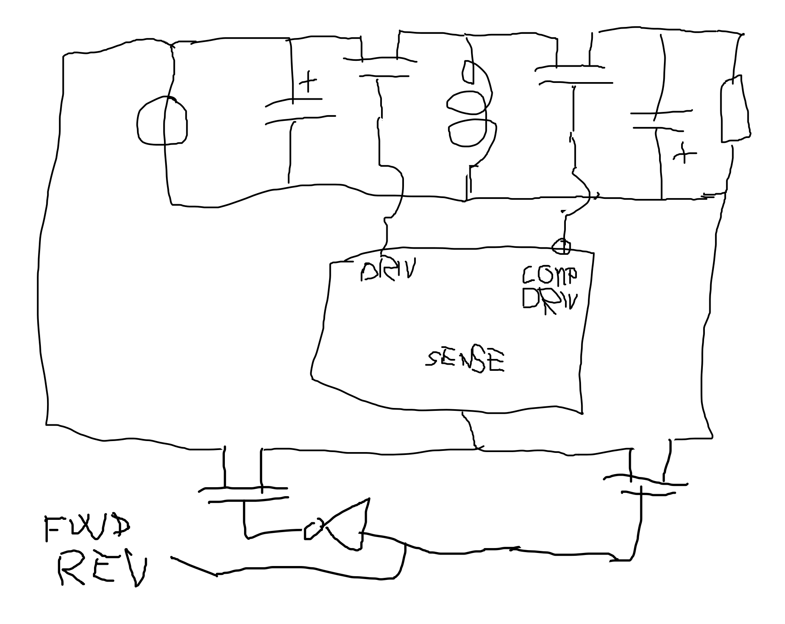

## Running a buckboost in reverse to charge and discharge



```
05:46:03 BrainDamage | this should make a buckboost converter work in reverse
05:46:24 BrainDamage | you need explicitly one that has a complementary driver to replace the diode
05:46:40 BrainDamage | then you swap the sense voltage pin
05:46:59 BrainDamage | also need a cap at the input
05:47:12 BrainDamage | unless I fucked up the circuit analysis, the vo/vi eq in ccm mode is the same
05:48:04 BrainDamage | so the circuit will start regulating the input instead of the output
05:49:46 BrainDamage | I might actually try that insanity to regen brake my bike
```
