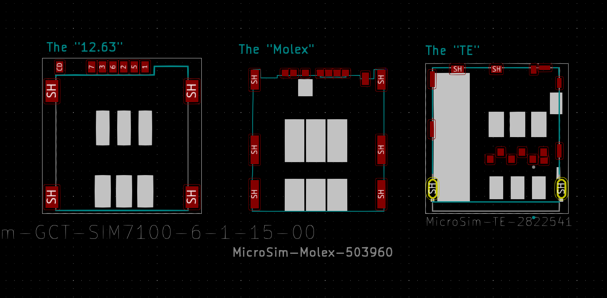

## Micro-SIM (3FF - 15mmx12mm) Push-Push holders.
If you are going to mount them on the board directly, and have users poke at the board
itself, feel free to go with push/pull or hinged, you've got
lots of options and they can be very cheap.  you should also just move straight to nano-sim.

If you want to use mini-sim, go back to 1998.  If you want to use nano-sim, but
use push-push, you're insane, how is anyone going to get any finger onto it through the case?
(which is why you want push-push sockets)

Based on Original research, karlp, Feb 2021.

You have a choice of three readily available footprints, and a variety of single vendor options.

### "TE" style.
This is use by the TE 2822541.  It's readily available on digikey _and_ lcsc.
It's a kinda _gross_ pinout, with a large keepout, and small fiddly pads, but, 
it's one of the cheapest, and it's definitely available.
It does have through hole mounting pins if you have barbarian users.
It also has clones available. (likely more, at least these from lcsc)

* SOFNG SMO-014
* XUNPU SMC-214

TE style is also the cheapest, by a decent margin, even on digikey.

### The "12.63" format, CD on the outside.
I'm not sure who the original design is here.  Comes in 6 pin and 8 pin versions.
(8 pins are for payment/nfc stuff, make your own choices)  CD is on the outside.
The 6 and 8 pin footprints are compatible, the extra two pads fill neatly into a
gap between the 6 sim pins and the CD pin.
I've named this for the vertial spacing between the mounting pads.
Much smaller keepout than the TE style, and generally "nicer" but, like that matters
to IRC professionals...

Available from digikey as:
* GCT SIM7100-6-1-15-00-A  (6 pin)
* GCT SIM7100-8-1-15-00-A  (8 pin)
* ADAM Tech MSCCP-D-06-SG-SW-T/R (6 pin)
* ADAM Tech MSCCP-D-08-SG-SW-T/R (8 pin)

Also available from lcsc as:
* SOFNG SMO-1511B -P6 (... 6 pin, duh)
* SOFNG SMO-1511B -P8 (yes. as many pins as you think it does)
* XKB XKSIM-003-P7 (6+CD)
* XKB XKSIM-115B-P9 (8+CD)

### The "Molex" 
Stand out features, three mounting pads on each side, and very small,
1mm pitch, 0.5mm square pads.

* Molex SD-503960-xxxx (numbers here seem to be materials for different portions)
* SOFNG SMO-1510 

### The "amphenol triple" (three mounting on each side, bigger pads than molex)
Fairly similar to the "Molex" but slightly bigger pads everywhere.
Still 1mm pitch though, you could _maybe_ make them work together?
*Be careful*, not all amphenol parts use this footprint.
Also, there's virtually zero stock of this, so, yay, multi vendor, but not really relevant.

* Amphenol G85B2x10xB1HR.
* SOFNG SMO-1507-P8

### The "nearly 12" style. 1.27mm pitch, CD inside.
Note that CD is on the inside here, vs the "12.63" style.
I've grouped these together as they're very similar, but not.... quite.
The contact pads are all the same, but the spacing of the ground pads is a little wonky.
You could probably use them with elongated pads to overlaps, but... there's other options.
For all of these, the with/without CD versions have the same footprint,
the CD pad goes in the gap. (if you look hard, there's probably a with CD version for
the "no CD" ones listed below.
(Even for the ones that are ~12.63 here, don't mix them up, CD is on the inside for
all of these)

* SOFNG SIM-002-P6 - 12.68 (No CD)
* Korean Hro Parts SIM-02A - 12.6 (No CD)
* SOFNG SIM-002-A7 - 12.6
* SOFNG SIM-002-A6 - 12.6 (No CD)
* XKB XKSIM-002-P6 - 12.52 (No CD)
* ADAM tech MSCCP-A1-06-SG-SW-T/R - 12.47
* XUNPU SMC-202-6 - 12.23 (no CD pin)
* XUNPU SMC-202-7 - 12.23

### "Others" digikey
So, all the parts above are multi vendor.  Some of the below might have clones
but I didn't find them.... 

* Amphenol G85B21611142HHR.  Footprint looks ok, 11.45 ground spacing...
* JAE SF56 Series, unusual footprint, not like anything else.

There's probably others, I didn't really look at things that were over $1.50 or so, as, well,
why on earth would you?!

### "Others" lcsc
These are parts that have no other lcsc part, and no other "western" part.  Some of them
appear to be nice designs, but they're all single vendor

* XUNPU SMC-202-7SC - also nice, but completely different

